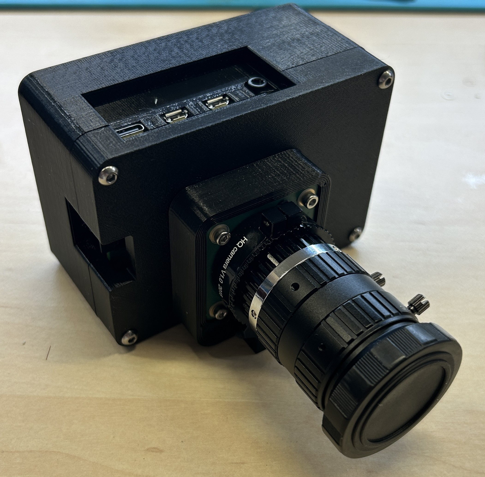
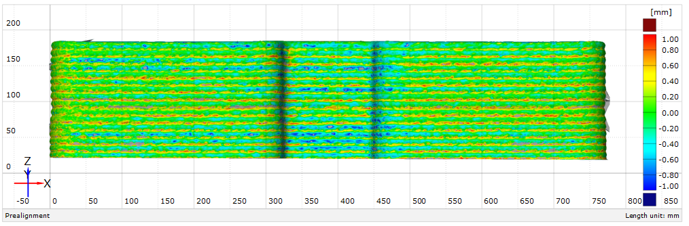
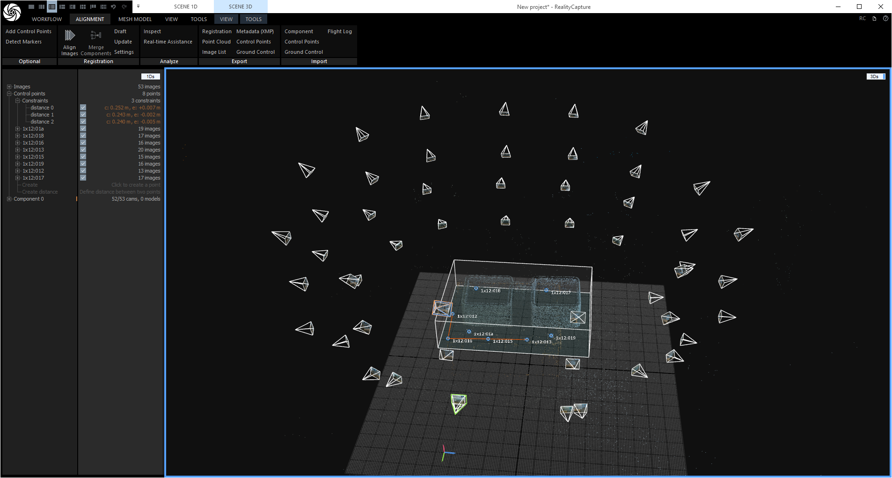
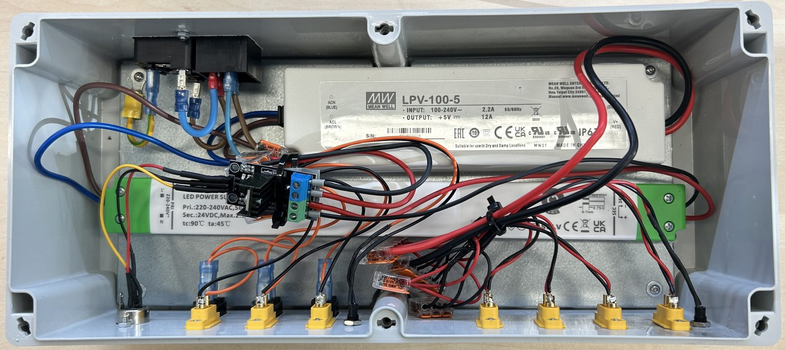
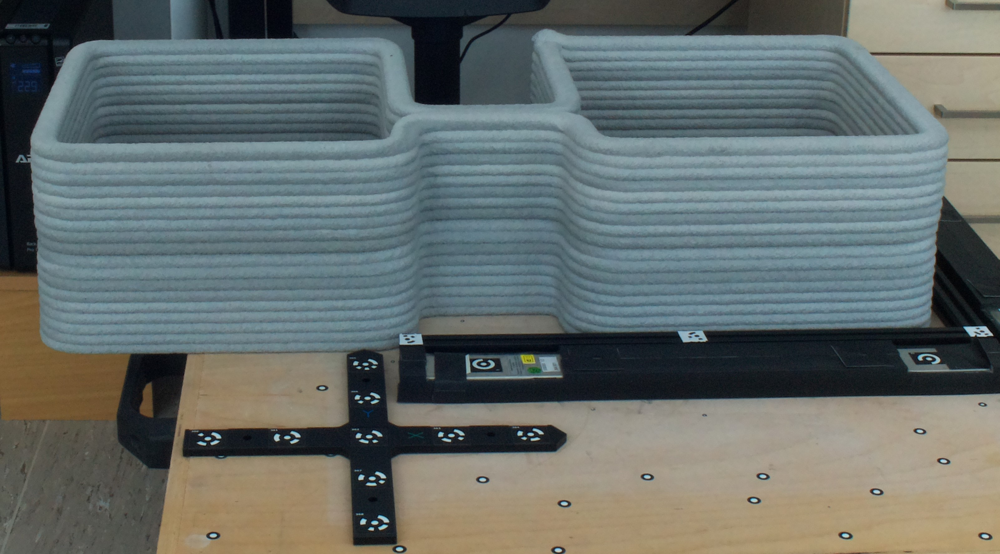
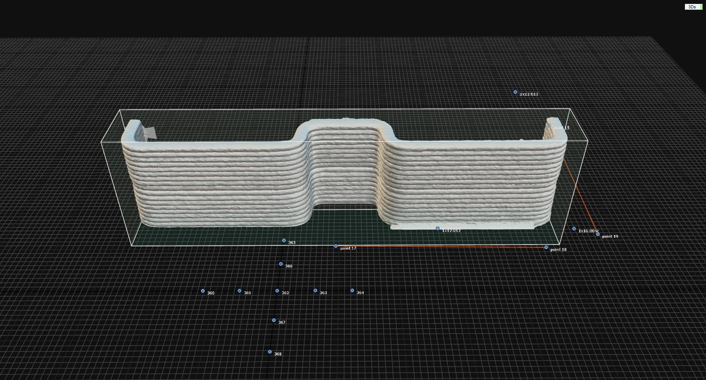

# 32-camera photogrammetry rig for 3D concrete printing

A measurement system designed to capture a 3D-printed concrete structure from 32
synchronized viewpoints at a single instant and reconstruct it
photogrammetrically. Built as my master's thesis at the Technical University of
Liberec in 2024 — hardware, capture software and accuracy validation, as a
working prototype rather than a paper study.

Concrete printing fails in a way that is hard to measure. The structure deforms
slowly under its own weight and then collapses quickly. A laser scanner is too
slow to catch it and a single camera cannot see around the part. Cameras firing
together freeze the whole geometry in one frame, which is what makes it possible
to track deformation over time and produce validation data for simulation
software.

**Scope, stated plainly:** the full eight-stand system is designed, and one stand
with its four cameras, lighting and power distribution was built and tested.
Validation was done on a finished, static printed wall — the camera unit was
repositioned to produce a 32-image set equivalent to the full rig. The system has
not yet been run during an actual print.

*Deviation against a MetraScan laser scan: 0.2–1 mm across the wall, concentrated
within individual printed layers.*

## Specification

| | |
|---|---|
| Cameras | 32 × Raspberry Pi HQ Camera (Sony IMX477) |
| Lens | Arducam 8 mm f/1.6, C-mount, manual focus and aperture |
| Compute | 32 × Raspberry Pi 4 Model B, 2 GB |
| Layout | 8 stands × 4 cameras designed; one stand built and tested |
| Capture | Simultaneous trigger over Wi-Fi, Python + libcamera, RAW + JPG |
| Typical settings | f/11, ISO 600–800, shutter 1/20–1/14 s |
| Lighting | 3 × 800 mm 24 V LED module per stand, 14.4 W/m, MOSFET dimming |
| Scale reference | Glass cross 415 × 415 mm, 9 coded targets, 70 mm markers |
| Reconstruction | RealityCapture 1.3 |
| Accuracy vs laser scan | 0.2–1 mm deviation (static test object) |
| Repeatability | ~0.3 mm between capture sets |

## How it works

### Why photogrammetry and not a scanner

A MetraScan-class laser scanner reaches 0.025 mm, an order better than this rig —
but it needs the object to hold still while it sweeps. A concrete wall deforming
as it cures does not. Fixed cameras trade accuracy for a capture that is
effectively instantaneous, which is the only way to reach the moments that
actually matter. The design question this thesis answers is whether that trade is
worth it: whether a rig of cheap Raspberry Pi cameras lands close enough to a
reference scan to be useful for deformation analysis.

*Resolved camera positions after alignment. Even coverage in regular rows
is what makes the reconstruction hold together — a single camera out of place
shows up here before it shows up in the mesh.*

### Stand design, and the version that failed

The first stand was my own build: 2020 aluminium extrusion with 3D-printed joints
and a telescoping centre section. It adjusted well and locked in position, but the
printed joints were the weak point — the threads stripped after a few tightening
cycles, and the top joint would not hold a one-metre profile even without cameras
on it.

I scrapped it and switched to a commercial photographic stand (Larmor GP-280A-Z,
100–280 cm, 9 kg capacity, 2.65 kg) with FT-S1 clamps and ball heads. Stiffness
and setup time both improved, and the whole system became something two people can
carry. Buying the solved part of the problem was the right call.

### Camera enclosures

The HQ camera connects to the Pi over a fragile ribbon cable, so each unit is
housed in a printed PET-G enclosure carrying the board, the camera module, a
Noctua NF-A4x10 PWM fan and a dust filter — the rig works next to a concrete
printer, so dust ingress is a real failure mode. Parts are joined with M3 threaded
inserts and designed to print with minimal support.

### Power distribution

Each stand has its own enclosure with two switching supplies: a Meanwell LPV-100-5
(5 V, 12 A) for four Pis and an FTPC60V24-S (24 V, 2.5 A) for the LED modules. All
connectors are keyed by type so camera, light and signal cables cannot be swapped
or reversed. Lighting intensity is driven through a MOSFET from one of the Pis.

### Scale and coordinate system

A glass cross with nine surveyed coded targets defines both scale and orientation,
since the points span a plane. Bar etalons are added for larger objects.
RealityCapture detects the cross automatically; the bar targets had to be picked
manually on every frame, which is the least elegant part of the workflow.

### Validation

The test object was a finished section of printed concrete wall with deliberate
surface defects. Three capture sets at different exposure settings were
reconstructed and compared against a MetraScan laser scan in GOM Inspect 2018.
Deviations ran 0.2–1 mm, concentrated within individual printed layers rather
than in the overall geometry — meaning the shape is captured well and the error
sits in surface texture.

Comparing the three reconstructions against each other gave ~0.3 mm. That
repeatability number is arguably the more useful one: deformation analysis
measures change between captures, so what matters is how much of a difference is
real and how much is the measurement chain moving under you.

*Reconstructed wall from a 32-camera set. Individual print layers, the bulge where
the wall began to yield and the surface defects are all resolved directly from the
photographs.*

### Limits

The system has not been tested during a live print, which is the obvious next
step and the only way to confirm that exposure times short enough to freeze a
moving surface still give usable reconstructions.

Large featureless surfaces reconstruct poorly — there is nothing for the matching
to lock onto. Projecting a dot pattern solves it.

Setup and per-camera focus calibration are manual and slow. The control software
is a working prototype: no GUI, no bulk camera configuration, no light or fan
control. Bar-etalon targets have to be picked by hand on every frame.

## Thesis

Vývoj systému pro bezkontaktní analýzu deformací objektů vyrobených 3D tiskem
z betonových směsí (2024), Technical University of Liberec, Faculty of Mechanical
Engineering. Supervisor: doc. Ing. Radomír Mendřický, Ph.D.
