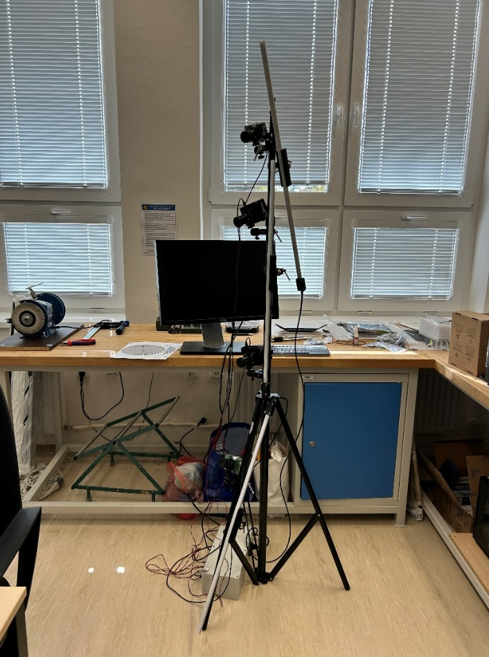

# 32-camera photogrammetry rig for 3D concrete printing



<!-- DOPLNIT: fotka postaveného stojanu s kamerami. Hned pod ni bych dal
     barevnou mapu odchylek z GOM Inspect — ta dvojice "hardware + ověřený
     výsledek" prodá celý projekt sama. -->

A measurement system that captures a 3D-printed concrete structure from 32
synchronized viewpoints at a single instant and reconstructs it
photogrammetrically. Built as my master's thesis at the Technical University of
Liberec in 2024, as a working prototype rather than a paper study.

Concrete printing fails in a way that is hard to measure. The structure deforms
slowly under its own weight and then collapses quickly. A laser scanner is too
slow to catch it and a single camera cannot see around the part. Thirty-two
cameras firing together freeze the whole geometry in one frame, which makes it
possible to track deformation over time and capture the collapse itself — and to
produce validation data for simulation software.

## Specification

| | |
|---|---|
| Cameras | 32 × Raspberry Pi HQ Camera (Sony IMX477) |
| Lens | Arducam 8 mm f/1.6, C-mount, manual focus and aperture |
| Compute | 32 × Raspberry Pi 4 Model B, 2 GB |
| Layout | 8 stands × 4 cameras, modular and transportable |
| Capture | Simultaneous trigger over Wi-Fi, Python + libcamera, RAW + JPG |
| Typical settings | f/11, ISO 600–800, shutter 1/20–1/14 s |
| Lighting | 3 × 800 mm 24 V LED module per stand, 14.4 W/m, MOSFET dimming |
| Scale reference | Glass cross 415 × 415 mm, 9 coded targets, 70 mm markers |
| Reconstruction | RealityCapture 1.3 |
| Accuracy vs laser scan | 0.2–1 mm deviation |
| Repeatability | ~0.3 mm between capture sets |

## How it works

**Why photogrammetry and not a scanner.** A MetraScan-class laser scanner reaches
0.025 mm, an order better than this rig — but it needs the object to hold still
while it sweeps. A collapsing concrete wall does not. Thirty-two fixed cameras
trade accuracy for a capture that is effectively instantaneous, which is the only
way to get the moment that actually matters.

**Stand design, and the version that failed.** The first stand was my own build:
2020 aluminium extrusion with 3D-printed joints and a telescoping centre section.
It adjusted well and locked in position, but the printed joints were the weak
point — the threads stripped after a few tightening cycles, and the top joint
would not hold a one-metre profile even without cameras on it. I scrapped it and
switched to a commercial photographic stand (Larmor GP-280A-Z, 100–280 cm, 9 kg
capacity, 2.65 kg) with FT-S1 clamps and ball heads. Stiffness and setup time both
improved, and the whole system became something two people can carry. Buying the
solved part of the problem was the right call.

**Camera enclosures.** The HQ camera connects to the Pi over a fragile ribbon
cable, so each unit is housed in a printed PET-G enclosure carrying the board, the
camera module, a Noctua NF-A4x10 PWM fan and a dust filter — the rig works next to
a concrete printer, so dust ingress is a real failure mode. Parts are joined with
M3 threaded inserts and designed to print with minimal support.

**Power distribution.** Each stand has its own enclosure with two switching
supplies: a Meanwell LPV-100-5 (5 V, 12 A) for four Pis and an FTPC60V24-S
(24 V, 2.5 A) for the LED modules. All connectors are keyed by type so camera,
light and signal cables cannot be swapped or reversed. Lighting intensity is
driven through a MOSFET from one of the Pis.

**Scale and coordinate system.** A glass cross with nine surveyed coded targets
defines both scale and orientation, since the points span a plane. Bar etalons are
added for larger objects. RealityCapture detects the cross automatically; the bar
targets had to be picked manually, which is the least elegant part of the workflow.

**Validation.** Three capture sets at different exposure settings were
reconstructed and compared against a MetraScan laser scan in GOM Inspect 2018.
Deviations ran 0.2–1 mm, concentrated within individual printed layers rather than
in the overall geometry. Comparing the three reconstructions against each other
gave ~0.3 mm, which is the repeatability figure that matters for tracking
deformation over time.

**Limits.** Large featureless surfaces reconstruct poorly — there is nothing for
the matching to lock onto. Projecting a dot pattern solves it and is the obvious
next step. Setup and per-camera focus calibration are manual and slow; the control
software is a working prototype with no GUI, no bulk camera configuration and no
light or fan control.

## Repository contents

```
cad/          Enclosures, mounts, lighting modules — STEP and STL
electronics/  Wiring diagrams for the power box and stand
software/     Capture scripts (libcamera, Python)
results/      Sample reconstructions and deviation maps
docs/         Method, calibration procedure, accuracy evaluation
images/       Photos of the rig and captured data
```

<!-- DOPLNIT: capture skript je tady nejcennější položka — ukazuje, že umíš
     rozchodit celý měřicí řetězec, ne jen navrhnout hardware. Nahraj ho
     i v prototypovém stavu. A ověř si u katedry, co smíš zveřejnit. -->

## Thesis

Vývoj systému pro bezkontaktní analýzu deformací objektů vyrobených 3D tiskem
z betonových směsí (2024), Technical University of Liberec, Faculty of Mechanical
Engineering. Supervisor: doc. Ing. Radomír Mendřický, Ph.D.

---

[← zpět na přehled projektů](../README.md)
